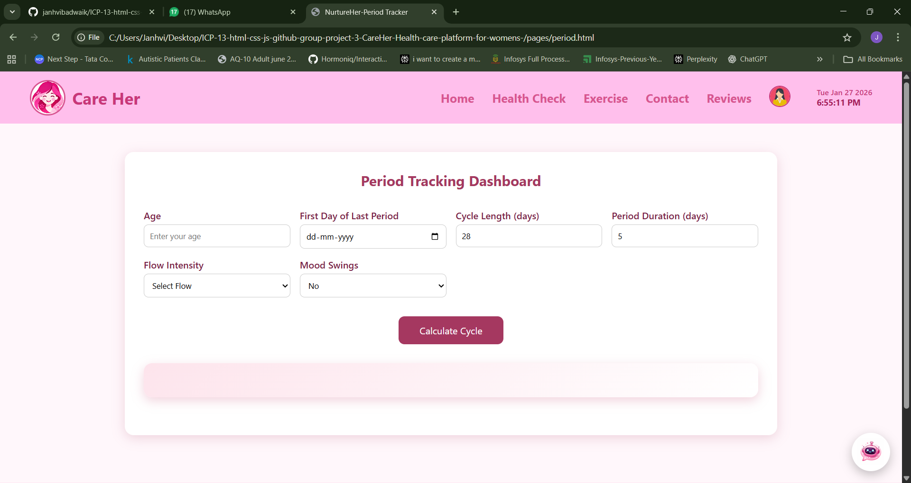
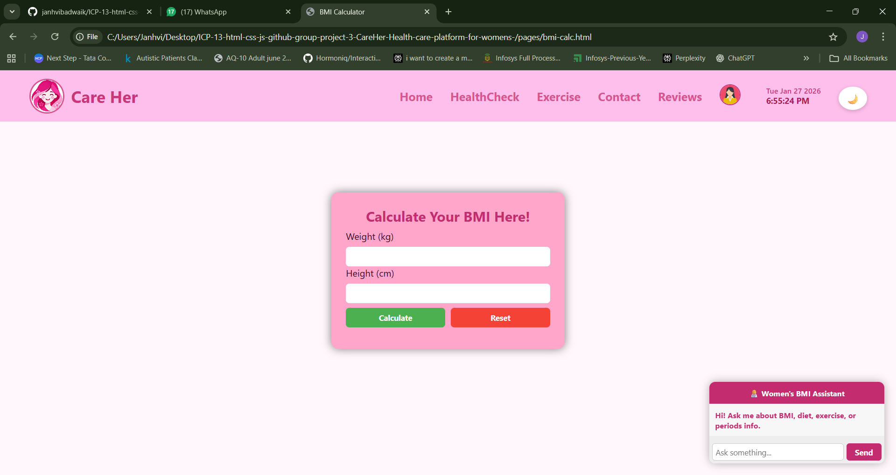
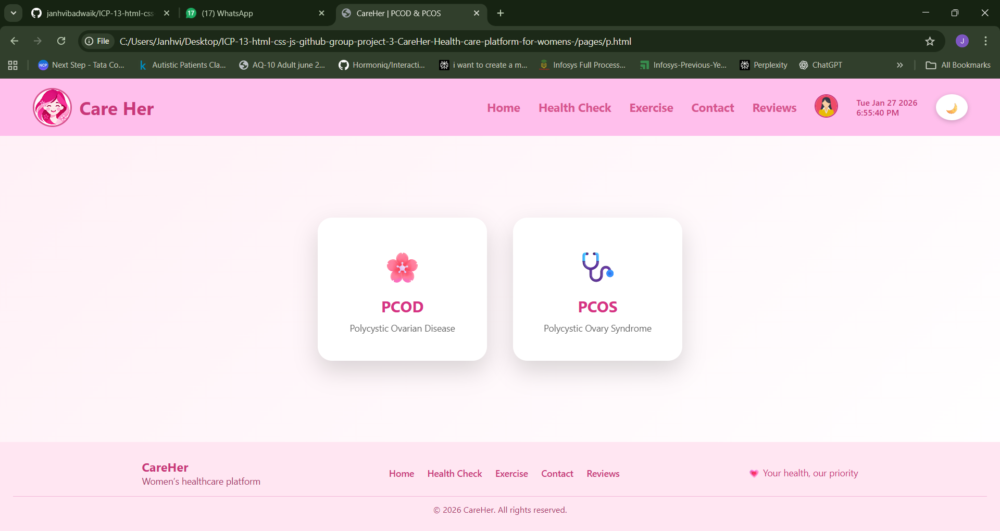

# 🌸 CareHer – HealthCare platform for womens 

Welcome to **CareHer**!  
CareHer is a responsive women-focused healthcare website built using **HTML, CSS, and JavaScript**, designed to promote menstrual health awareness, cycle tracking, and overall wellness through a soft and user-friendly interface and with excercise and diet plan with chatbot integration.

🌐 **Live Website:** https://careher.netlify.app/

---

## 🚀 Features  

- **Navigation Bar & Footer** – Smooth navigation across all pages  
- **Home Page** – Introduction to CareHer and its mission  
- **Period / Cycle Tracker** – Calculate menstrual cycle details  
- **Diet & Health Guidance** – Helpful tips for irregular periods  
- **Chatbot Support** – Friendly chatbot for quick assistance  
- **Modern UI Design** – Soft pink theme focused on women’s wellness  
- **Responsive Design** – Works on desktop, tablet, and mobile  

---
## 📄 Pages Included

| Page Name                | File Name              | Description                                                       |
|--------------------------|------------------------|-------------------------------------------------------------------|
| Home                 | `index.html`           | Welcome page and main navigation                                 |
| Health Check         | `healthcheck.html`     | Central health tools section                                      |
| BMI Calculator       | `bmi-calc.html`             | Calculates Body Mass Index using height and weight                |
| Period Tracker       | `period.html`          | Tracks menstrual cycle and predicts next period                   |
| PCOD / PCOS Detection| `p.html`       | Helps assess PCOD/PCOS symptoms using user inputs                 |
| Exercise             | `exercise.html`        | Workout and fitness guidance for women                            |
| Reviews              | `reviews.html`         | User feedback and testimonials                                   |
| Contact              | `contact.html`         | Contact details and support information                            |
| 👩login/signup        | `signup.html`           | User login and management page                                   |
         |

---

## 🛠️ Tech Stack  

- **HTML** – Structure of the website  
- **CSS** – Styling and responsive layout  
- **JavaScript** – interactivity and health calculations

---

## 🚀 How to Run  

1. Download or clone the repository  
2. Open the `index.html` file in your browser  
3. Navigate through the website using the navigation bar  

---

## 📷 Screenshots  

### Home Page  

### Cycle Tracker  

### BMI Calculator  

### PCOD/PCOS Detection

---
##  Contributors
Developed by *Team CareHer Project*

- Janhvi Badwaik. (`index.html`,`healthcheck.html`,`period.html`)
- Akshada Sanap. (`p.html`,`pcod-risk.html`,`pcos-risk.html`)
- Akash Lohar.  (`signup.html`,`review.html`,`exercise.html`)
- Sarthak Ranade.(`bmi-calc`,`contact.html`)

  

Made with [contrib.rocks](https://contrib.rocks).
---

